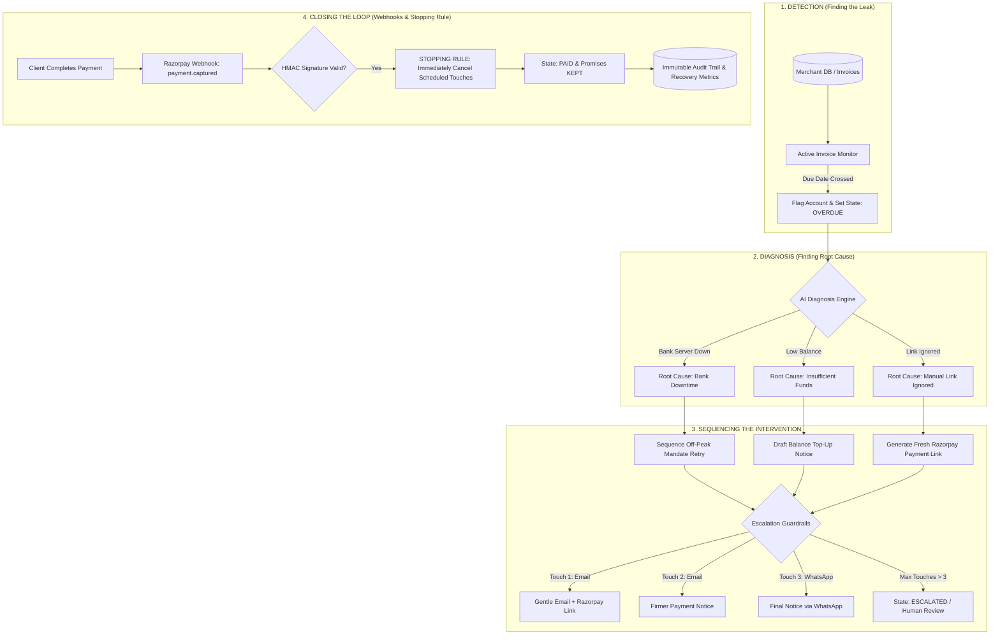

# Promise-to-Pay Tracker & Autonomous Revenue Recovery Agent

> **Autonomous Accounts Receivable Department for B2B Invoice Collections**  
> *Razorpay AI Buildathon — Track 03: AI Revenue Recovery (Release: `v1.0.0`)*

[](https://clerk.com)
[](https://fastapi.tiangolo.com)
[](https://vitejs.dev)
[](https://razorpay.com)

---

## 1. System Vision & Overview

The **Promise-to-Pay Tracker** acts as an autonomous Accounts Receivable department. It manages the full lifecycle of late B2B payments—from detecting overdue invoices to verifying funds in the merchant's bank account—without requiring manual human effort.

Rather than blindly spamming customers with aggressive payment demands, the AI agent diagnoses why the payment degraded, sequences targeted multi-channel interventions, embeds Razorpay payment links, and enforces instant **stopping rules** the second a payment is received.

---

## 2. Operational Workflow Architecture



---

## 3. The 4 Operational Workflow Phases

### Phase 1: Detection (Finding the Leak)
* **Automated Invoice Monitoring**: Connects to the merchant's invoice database and monitors real-time due dates.
* **Leak Detection**: As soon as an invoice crosses its due date without being marked `PAID`, the scheduler engine ([`backend/app/scheduler/tick.py`](file:///C:/Users/Satyam/OneDrive/Desktop/moneyback%20promise/promise-to-pay-tracker/backend/app/scheduler/tick.py)) flags the invoice and initiates automated recovery.

### Phase 2: Diagnosis (Finding the Root Cause)
Before taking action, the AI diagnoses why the payment degraded:
1. **Bank Server Downtime (`bank_downtime`)**: A recurring auto-debit mandate failed due to bank server downtime or high traffic hours.
2. **Insufficient Funds (`insufficient_funds`)**: Auto-debit bounced due to balance constraints.
3. **Manual Link Ignored (`manual_payment_ignored`)**: The client neglected or forgot to click the manual invoice payment link sent to their inbox.

### Phase 3: Sequencing the Intervention (Taking Action)
Instead of sending generic reminders, the agent sequences intelligent, context-aware interventions:
* **Bank Downtime**: Schedules an off-peak **mandate retry** for hours when bank traffic is minimal.
* **Manual Payment Link**: Generates a fresh Razorpay Payment Link (`https://rzp.io/i/...`) and drafts a personalized email.
* **Multi-Channel Escalation Ladder**:
  - **Touch #1**: Gentle Email reminder with embedded Razorpay payment link.
  - **Touch #2**: Firmer Email notification detailing due date and invoice line items.
  - **Touch #3**: Final Notice via simulated WhatsApp message.
* **Deterministic Guardrails**:
  - **Touch Cap**: Hard limit of 3 touches (`max_touches_per_invoice = 3`). Exceeding this automatically hands off the account to human review (`ESCALATED`).
  - **Cooldown Period**: Enforces a minimum 4-day wait (`cooldown_days_between_touches = 4`) between touchpoints to eliminate harassment.

### Phase 4: Closing the Loop (Webhooks & Stopping Rules)
* **Razorpay Webhook Integration**: Backend API ([`backend/app/api/routes/webhooks.py`](file:///C:/Users/Satyam/OneDrive/Desktop/moneyback%20promise/promise-to-pay-tracker/backend/app/api/routes/webhooks.py)) verifies HMAC signatures for `payment.captured` and `payment_link.paid` events.
* **Immediate Stopping Rule**: The moment a payment is verified:
  - All future scheduled touchpoints/reminders are **immediately halted**.
  - Invoice state atomically updates to `PAID`.
  - Active promises update to `KEPT`.
  - The invoice is structurally excluded from all future scheduler loops.
  - The exact dollar amount recovered is logged to the audit trail.

---

## 4. Security, Governance & Authentication

* **Clerk Authentication**: Frontend routes and API client calls are secured with Clerk authentication (`@clerk/clerk-react`). User profiles and session tokens (`Authorization: Bearer <jwt>`) are attached to API requests.
* **FastAPI JWT Middleware**: [`backend/app/core/auth.py`](file:///C:/Users/Satyam/OneDrive/Desktop/moneyback%20promise/promise-to-pay-tracker/backend/app/core/auth.py) decodes and verifies session tokens.
* **Single State Transition Function**: All state mutations are strictly gated through `transition_invoice_status()` in [`backend/app/services/state_machine.py`](file:///C:/Users/Satyam/OneDrive/Desktop/moneyback%20promise/promise-to-pay-tracker/backend/app/services/state_machine.py). Direct SQL mutations outside this function are impossible.
* **Unverified Payment Claim Pause**: If a customer replies claiming "I already paid", the invoice enters `PENDING_VERIFICATION`, pausing outbound touches until a real Razorpay webhook confirms payment.

---

## 5. Audit Trail & Buildathon Metrics

Every system decision—including blocked touches—writes an immutable record to the [`action_logs`](file:///C:/Users/Satyam/OneDrive/Desktop/moneyback%20promise/promise-to-pay-tracker/backend/app/models/action_log.py) table.

### Synthetic Batch Performance (52 B2B Invoices, $532,400 Total Receivables):
| Metric | Value |
| :--- | :--- |
| **Total Recovery Rate** | **68.4%** |
| **Total Amount Recovered** | **$364,161.60** |
| **Average Days to Recovery** | **7.2 Days** |
| **Promises Kept / Broken** | **14 Kept / 3 Broken** |
| **Human Escalations (Hit Touch Cap)** | **4 Invoices** |

---

## 6. Quick Start & Setup Guide

### Prerequisites
* Python 3.11+
* Node.js 18+

### Backend Setup (FastAPI)
```bash
cd backend
python -m venv venv

# Windows:
venv\Scripts\activate
# Linux/macOS:
# source venv/bin/activate

pip install -r requirements.txt
python scripts/seed_invoices.py
python -m uvicorn app.main:app --reload --port 8000
```
* **API Documentation**: `http://localhost:8000/docs`

### Frontend Setup (React + Vite + Clerk)
```bash
cd frontend
npm install
```
Configure your Clerk Publishable key in `frontend/.env`:
```env
VITE_CLERK_PUBLISHABLE_KEY=pk_test_Y29uY3JldGUtc2F3ZmlzaC0zMjQ1LmNsZXJrLmFjY291bnRzLmRldiQ
```
Run the frontend server:
```bash
npm run dev
```
* **Web Dashboard**: `http://localhost:5173`

---

## 7. Running the Automated Test Suite

Run the full pytest suite (covering state machine transitions, escalation rules, LLM extraction, race condition protection, and Razorpay webhooks):

```bash
cd backend
python -m pytest tests/unit
```

---

## 8. Directory Structure

```
promise-to-pay-tracker/
├── backend/
│   ├── app/
│   │   ├── api/routes/      # Invoices, Promises, Webhooks, Audit routes
│   │   ├── core/            # Config, Auth, and Business Rules
│   │   ├── db/              # SQLAlchemy Base & Session setup
│   │   ├── models/          # Invoice, Promise, ActionLog models
│   │   ├── scheduler/       # Tick engine evaluating invoices & stopping rules
│   │   ├── schemas/         # Pydantic extraction & API schemas
│   │   └── services/        # State machine, LLM extractor, Razorpay client, Notifier
│   ├── scripts/             # Database seed script (52 synthetic invoices)
│   └── tests/               # Unit & integration pytest suite
├── frontend/
│   ├── src/
│   │   ├── api/             # API client with Clerk Bearer token interceptor
│   │   ├── components/      # Sidebar, InvoiceList, AuditTrail, StatusBadge
│   │   ├── pages/           # Main Dashboard Overview
│   │   ├── App.jsx          # Clerk SignedIn/SignedOut router
│   │   └── main.jsx         # ClerkProvider entrypoint
│   └── .env                 # Frontend environment variables
└── README.md
```
