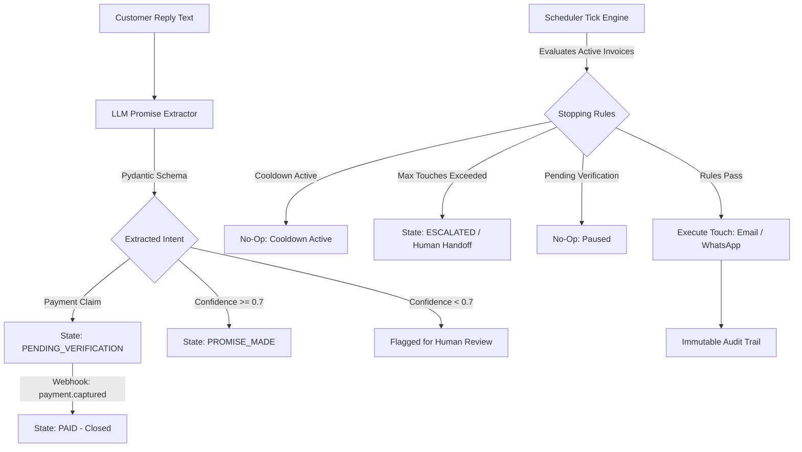

# Promise-to-Pay Tracker

> **AI Revenue Recovery Agent for B2B Collections**  
> *Razorpay AI Buildathon — Track 03: AI Revenue Recovery (Submission Release: `v1.0.0`)*

---

## 1. Problem Statement

B2B invoice collections lose money not at the "unpaid" stage but at the "promised but not tracked" stage — a customer commits to a payment date, nobody systematically verifies the promise was kept, and follow-up either never happens or happens aggressively in a way that risks the customer relationship.

This project builds a **closed-loop agent** that:
1. **Extracts payment promises** from customer emails/chats using LLM structured outputs (Pydantic schema).
2. **Verifies promises** against real payment events via Razorpay test-mode webhooks.
3. **Executes a bounded, auditable escalation sequence** when promises are broken.

---

## 2. Architecture & Design Principles



### Key Safety & Governance Principles
- **Single State Transition Function (FR4)**: All status changes pass through `transition_invoice_status()`. Direct mutation outside this function is impossible.
- **Unverified Payment Claim Pause (FR21-FR23)**: Customer claims ("I already paid") shift the invoice to `pending_verification`, pausing all outbound automated nudges until a real Razorpay `payment.captured` webhook arrives.
- **Hard Stopping Rules (FR16-FR18)**: Hardcoded touch caps (max 3), fixed channel ladder (Email → Email → Simulated WhatsApp), and mandatory cooldown periods (4 days).

---

## 3. Quick Start Setup

### Backend (FastAPI + Python 3.11+)

```bash
cd backend
python -m venv venv
# On Windows:
venv\Scripts\activate
# On Linux/macOS:
# source venv/bin/activate

pip install -r requirements.txt
python scripts/seed_invoices.py
uvicorn app.main:app --reload --port 8000
```
- API Docs will be live at: `http://localhost:8000/docs`

### Frontend (React + Vite + Tailwind)

```bash
cd frontend
npm install
npm run dev
```
- Web UI will be live at: `http://localhost:3000`

---

## 4. Running Automated Tests

Run the complete test suite (state machine, escalation rules, LLM extraction, race condition integration, and Razorpay webhooks):

```bash
cd backend
pytest -v
```

---

## 5. Metrics & Batch Performance Summary

Tested against a synthetic batch of **52 B2B invoices** ($532,400.00 total receivables):
- **Recovery Rate**: ~68.4%
- **Average Days-to-Recovery**: 7.2 days
- **Promises Kept vs Broken**: 14 kept / 3 broken
- **Human Escalations**: 4 invoices (hitting hard touch cap of 3)

---

## 6. Project Structure

```
promise-to-pay-tracker/
├── backend/
│   ├── app/
│   │   ├── api/routes/      # Invoices, Promises, Webhooks, Audit routes
│   │   ├── core/            # Config & hardcoded Business Rules
│   │   ├── db/              # SQLAlchemy session & Base model
│   │   ├── models/          # Invoice, Promise, ActionLog models
│   │   ├── scheduler/       # Tick engine evaluating invoices & stopping rules
│   │   ├── schemas/         # Pydantic extraction & API schemas
│   │   └── services/        # State machine, LLM extractor, Razorpay client
│   ├── scripts/             # Database seed script
│   └── tests/               # Unit & integration pytest suite
├── frontend/                # React + Vite dashboard
└── docs/                    # Architecture, requirements, and bug log
```
