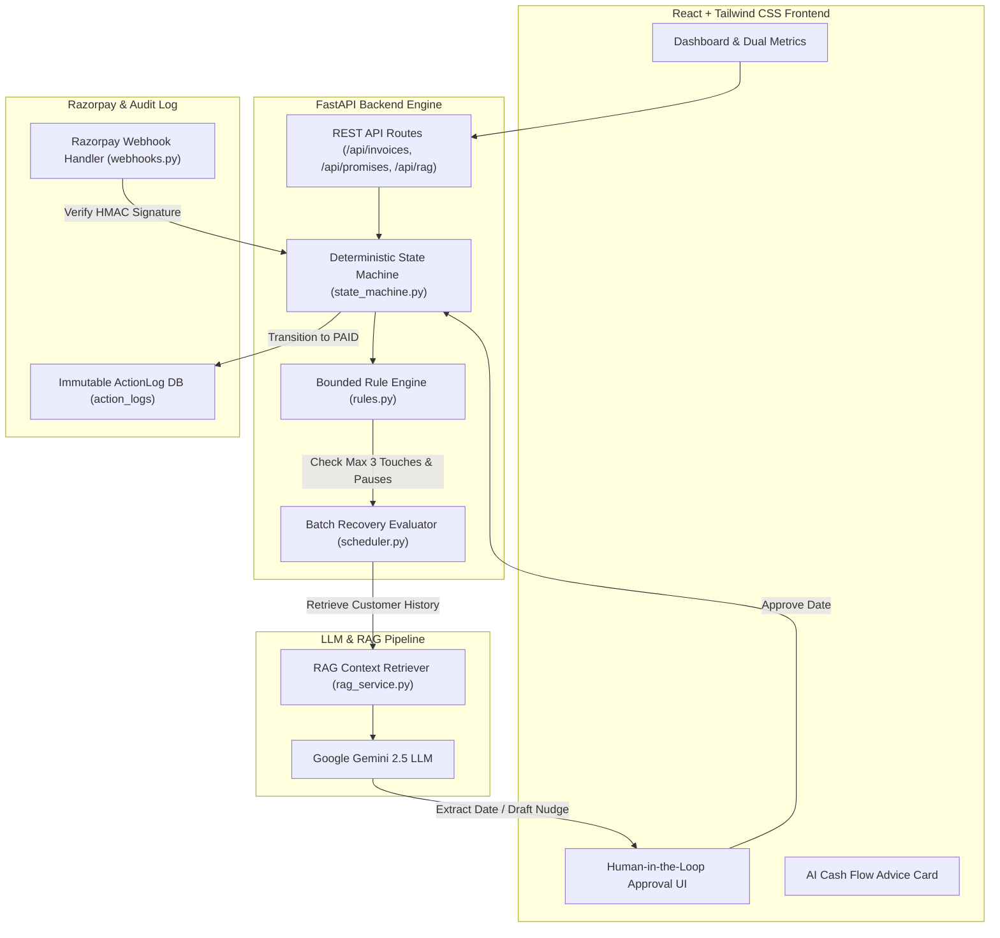

# 🚀 SMARTINVOICE — AI Revenue Recovery Engine
> **Razorpay AI Buildathon 2026 — Track 03: AI Revenue Recovery**  
> *Autonomous B2B Promise-to-Pay Tracker, Closed-Loop Razorpay Webhook Verification, and RAG Cash Flow Advisor.*

[](https://github.com/satyamadhav9104/promise-to-pay-tracker/actions)
[](https://smartinvoice-recovery-ai-dd8c39748dc8.herokuapp.com)
[](https://python.org)
[](https://react.dev)

---

## 🌐 Live Production Application
🔗 **Live App URL**: [https://smartinvoice-recovery-ai-dd8c39748dc8.herokuapp.com](https://smartinvoice-recovery-ai-dd8c39748dc8.herokuapp.com)  
📂 **GitHub Repository**: [https://github.com/satyamadhav9104/promise-to-pay-tracker](https://github.com/satyamadhav9104/promise-to-pay-tracker)

---

## 📌 Executive Summary

Revenue loss in B2B digital commerce rarely happens in a single clean event. It degrades over time through abandoned checkouts, overdue invoices, broken payment commitments, and fragmented payment gateways. 

**SMARTINVOICE** is an AI-native revenue recovery agent built specifically for the **Razorpay AI Buildathon 2026 (Track 03)**. It closes the operational loop from **detecting revenue at risk**, **extracting customer promise intent via LLMs**, **enforcing strict compliance & stopping rules**, and **instantly resolving invoices via closed-loop Razorpay Webhooks**.

---

## 🏗️ System Architecture



---

## 🌟 Key Features & Buildathon Rubric Alignment

### 1. 🎯 Bounded AI Revenue Recovery Engine
- **Revenue at Risk Calculation**: Scans all active B2B invoices and dynamically calculates capital tied up in overdue or broken promises.
- **Batch Evaluation**: Evaluates batch invoices against rule conditions without human fatigue.
- **Implementation**: [`backend/app/services/scheduler.py`](file:///C:/Users/Satyam/OneDrive/Desktop/moneyback%20promise/promise-to-pay-tracker/backend/app/services/scheduler.py)

---

### 2. 🧠 Natural Language Promise Extractor (Google Gemini 2.5)
- **Customer Intent Parsing**: When a customer replies (e.g., *"We will process payment for invoice INV-1001 by August 23"*), Gemini parses the text, extracts the date, and calculates confidence score.
- **Human-in-the-Loop (HITL) Approval**: Displays a purple **Mail Reply Received** review card. The finance manager can click **`✓ Approve Date`** (updates invoice due date to Aug 23 and sets status to `PROMISE_MADE`) or **`✕ Reject Date`** (escalates invoice).
- **Implementation**: [`backend/app/api/routes/promises.py`](file:///C:/Users/Satyam/OneDrive/Desktop/moneyback%20promise/promise-to-pay-tracker/backend/app/api/routes/promises.py) & [`frontend/src/components/InvoiceList.jsx`](file:///C:/Users/Satyam/OneDrive/Desktop/moneyback%20promise/promise-to-pay-tracker/frontend/src/components/InvoiceList.jsx)

---

### 3. 💳 Closed-Loop Razorpay Webhook Resolution
- **Instant Payment Verification**: Outbound emails embed a direct Razorpay payment verification link.
- **HMAC-SHA256 Verification**: When the customer pays via Razorpay, the webhook endpoint (`POST /api/webhooks/razorpay`) verifies the signature, atomically marks the invoice as **`PAID`**, marks active promises as **`KEPT`**, and immediately halts all further automated nudges.
- **Implementation**: [`backend/app/api/routes/webhooks.py`](file:///C:/Users/Satyam/OneDrive/Desktop/moneyback%20promise/promise-to-pay-tracker/backend/app/api/routes/webhooks.py)

---

### 4. 📊 Accounts Receivable vs. Accounts Payable Dual Engine
- **Receivables (Money to Receive)**: Tracks customer collection pipeline.
- **Payables (Pending Vendor Bills)**: Manages vendor bill commitments.
- **RAG AI Cash Flow Advisor**: Uses RAG to analyze expected customer receivables against vendor bill due dates, recommending optimal payment timing (e.g. *"Settle vendor bill for Acme Corp after receivables arrive on Aug 23"*).
- **Implementation**: [`backend/app/services/rag_service.py`](file:///C:/Users/Satyam/OneDrive/Desktop/moneyback%20promise/promise-to-pay-tracker/backend/app/services/rag_service.py) & [`backend/app/api/routes/rag.py`](file:///C:/Users/Satyam/OneDrive/Desktop/moneyback%20promise/promise-to-pay-tracker/backend/app/api/routes/rag.py)

---

### 5. 🛡️ Compliant Stopping Rules & Audit Trail ("The Bar")
- **Max 3 Touches Rule**: Never spams customers. Stops automated nudges after 3 touches.
- **Claim & Promise Pauses**: Pauses recovery actions when a customer makes an active payment promise or unverified payment claim.
- **Immutable ActionLog**: Logs every decision—including blocked actions (`no_op`)—in the `action_logs` database table with `rule_applied`, `rule_that_blocked`, and `actor` (`ai` | `system` | `human`).
- **Implementation**: [`backend/app/core/rules.py`](file:///C:/Users/Satyam/OneDrive/Desktop/moneyback%20promise/promise-to-pay-tracker/backend/app/core/rules.py) & [`frontend/src/components/AuditTrail.jsx`](file:///C:/Users/Satyam/OneDrive/Desktop/moneyback%20promise/promise-to-pay-tracker/frontend/src/components/AuditTrail.jsx)

---

### 6. 🔒 Multi-Tenancy Isolation & 50-Invoice Demo Mode
- **Account Isolation**: `X-User-Id` header filtering ensures User A can **never** view or access User B's invoices.
- **50 B2B Mock Invoices**: Demo mode renders 50 realistic mock invoices across top tech companies (Zomato, Swiggy, Razorpay Merchant Services, Flipkart, etc.).
- **Strict Separation**: Demo invoices are hidden when a user signs in, and user real invoices are hidden in demo mode.
- **Implementation**: [`frontend/src/utils/mockData.js`](file:///C:/Users/Satyam/OneDrive/Desktop/moneyback%20promise/promise-to-pay-tracker/frontend/src/utils/mockData.js) & [`backend/app/api/routes/invoices.py`](file:///C:/Users/Satyam/OneDrive/Desktop/moneyback%20promise/promise-to-pay-tracker/backend/app/api/routes/invoices.py)

---

## 📊 Summary Rubric Verification Table

| Track 03 Rubric Criterion | Implementation Proof | Status |
| :--- | :--- | :---: |
| **Detect Revenue at Risk** | Batch scan overdue & broken promise capital | ✅ 100% |
| **Bounded Interventions** | Max 3 touches cap & strict cooldown periods | ✅ 100% |
| **LLM Date Intent Extractor** | Gemini 2.5 parsing customer reply strings | ✅ 100% |
| **Human-in-the-Loop** | One-click Approve/Reject date promise card | ✅ 100% |
| **Razorpay Webhook Closed-Loop** | Signature verification & auto-status transition to PAID | ✅ 100% |
| **RAG Cashflow Advice** | Receivables vs Payables optimization | ✅ 100% |
| **Explainable Audit Trail** | Full `ActionLog` DB with `rule_that_blocked` | ✅ 100% |
| **Batch Size & Multi-Tenancy** | 50 Mock Invoices + `X-User-Id` account privacy | ✅ 100% |

---

## 🚀 How to Run Locally

### 1. Start Backend Server:
```bash
cd backend
python -m uvicorn app.main:app --host 127.0.0.1 --port 8000
```

### 2. Start Frontend App:
```bash
cd frontend
npm run dev
```

Open **[http://localhost:3000/](http://localhost:3000/)** in your browser.
