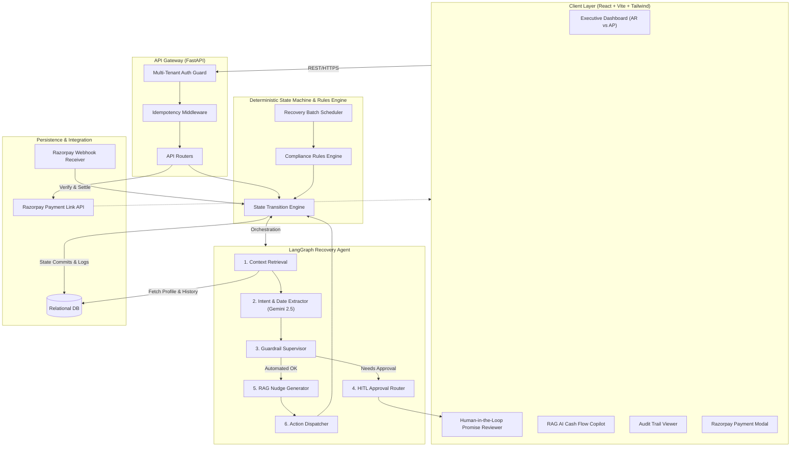
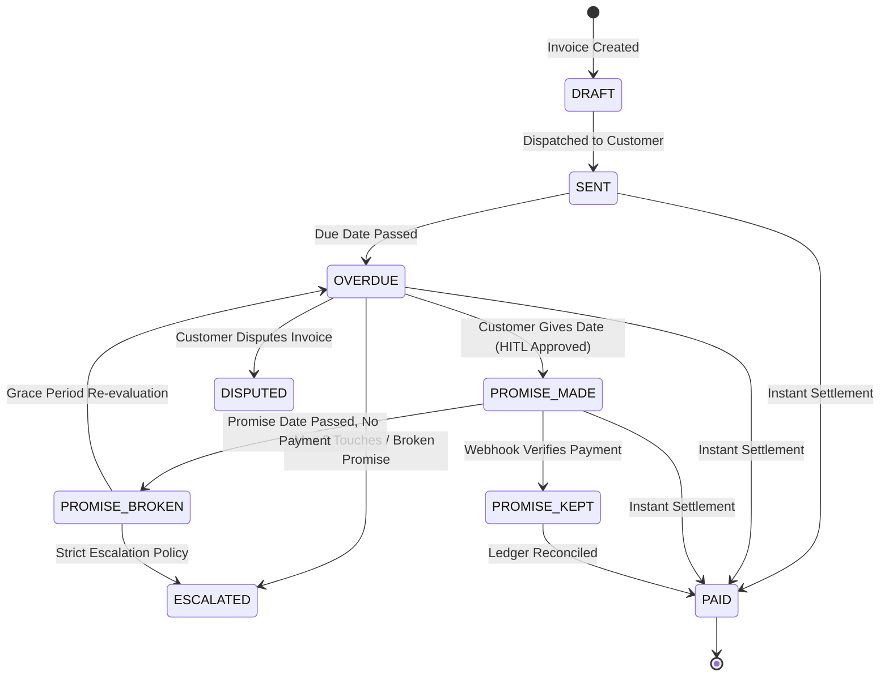
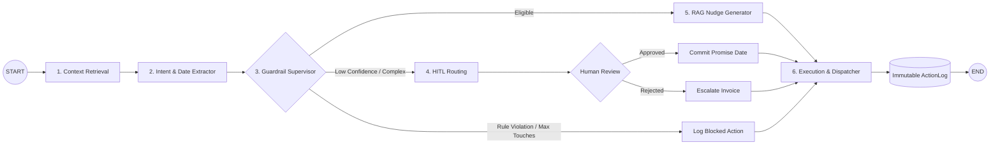
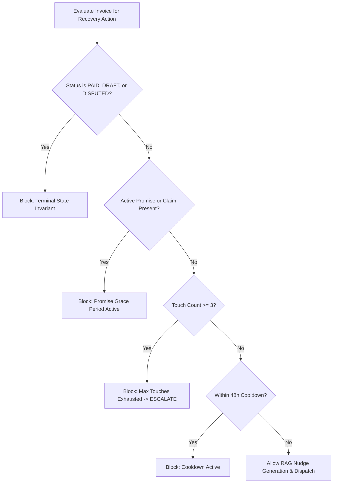
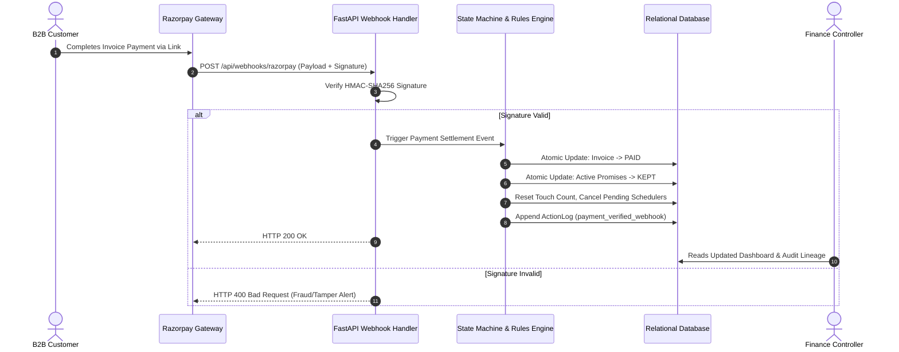
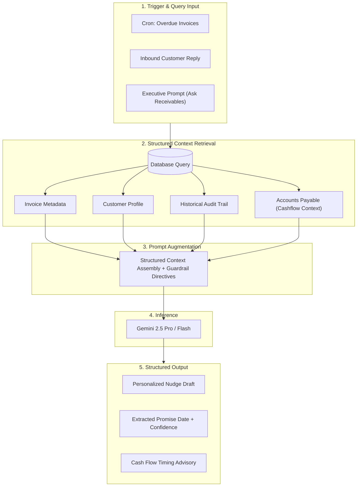
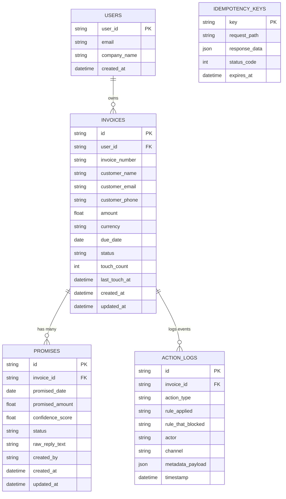
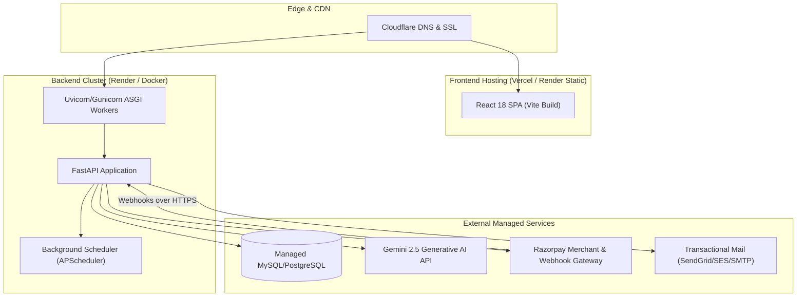

# SMARTINVOICE — Architecture Explainer

> **Razorpay AI Buildathon 2026 — Track 03: AI Revenue Recovery**
Autonomous B2B Promise-to-Pay Tracker, Closed-Loop Razorpay Webhook Verification, and RAG Cash Flow Advisor.
> 

<aside>
💡

SMARTINVOICE combines a **deterministic state machine** (so accounting never gets corrupted by AI hallucination) with a **stateful LangGraph AI agent** (so recovery outreach is smart and personalized) — bounded by strict compliance rules and kept in sync in real time via Razorpay webhooks.

</aside>

# 1. High-Level System Overview

The full request path: client UI → API gateway → state machine/rules engine → AI agent → database & Razorpay.

<aside>
🧩

**Why this layering matters:** the AI agent can only *propose* actions — the deterministic state machine is the sole authority that commits state changes. This means an LLM hallucination can never directly corrupt the ledger.

</aside>

---

# 2. Invoice Lifecycle (State Machine)

Every invoice moves through a strict, auditable set of states. This is the backbone that keeps the system trustworthy.

- State reference table
    
    
    | **State** | **Description** | **Recovery Behavior** |
    | --- | --- | --- |
    | DRAFT | Invoice created, unissued | Inactive |
    | SENT | Dispatched to client | Monitored until due date |
    | OVERDUE | Past due, no promise | Autonomous RAG nudge evaluation active |
    | PROMISE_MADE | Client promised date T | All automated nudges paused until T |
    | PROMISE_KEPT | Paid on/before T | Success logged, all actions stop |
    | PROMISE_BROKEN | T passed, no payment | Escalation flag raised |
    | PAID | Fully settled | Terminal state; complete halt |
    | DISPUTED | Client flagged billing issue | Paused for human resolution |
    | ESCALATED | 3 touches exhausted / broken promise | Routed to Senior Finance Executive |

---

# 3. LangGraph Recovery Agent (the "brain")

A cyclical, stateful graph that decides what to do about each overdue invoice.

**What each node does:**

- **Context Retrieval** — pulls customer reliability rating, payment history, invoice details, past touches
- **Intent & Date Extractor** — Gemini 2.5 converts natural language ("next Wednesday post-audit") into ISO-8601 dates
- **Guardrail Supervisor** — checks business rules before anything goes out
- **HITL Routing** — sends ambiguous cases to a human for one-click approval
- **RAG Nudge Generator** — writes personalized recovery messages per channel (Email/WhatsApp/SMS)
- **Execution & Dispatcher** — commits DB changes, sends the message, writes the audit log

---

# 4. "The Bar" — Compliance & Stopping Rules

Hard invariants that stop the AI from spamming customers or acting outside policy.

<aside>
🛑

**Key invariants:** max 3 autonomous touches per invoice · channel escalation Email → WhatsApp → urgent SMS · active promises silence all reminders · a payment claim pauses nudges until webhook/bank verification · every evaluation (allowed or blocked) is written to `action_logs`.

</aside>

---

# 5. Closed-Loop Razorpay Webhook Verification

How a real payment turns into a verified, atomic state change — this is what makes the recovery loop trustworthy.

---

# 6. RAG Pipeline (Cash Flow Copilot)

How the system answers natural-language questions and drafts nudges, grounded in real data (not hallucinated).

---

# 7. Database Schema (ER Diagram)

---

# 8. Production Deployment Topology

---

# 9. Resilience & Security Guardrails

1. **Multi-Tenant Data Privacy** — every query filters by `user_id`; no cross-tenant leakage at the ORM layer
2. **Deterministic LLM Output Validation** — Pydantic/JSON schemas validate every Gemini response before it can change system state
3. **Fail-Safe Fallback Parser** — regex-based date extraction if Gemini latency spikes or rate limits hit
4. **Idempotent Webhook Processing** — duplicate `payment_id` deliveries can't create duplicate credits
5. **Full Action Auditability** — every permitted, blocked, or escalated decision is written to `action_logs` with explainable telemetry
