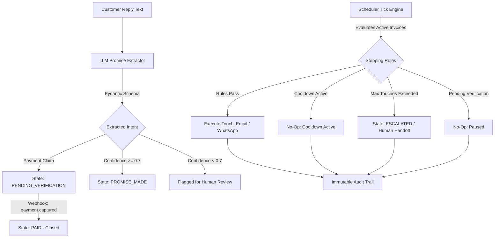

# Promise-to-Pay Tracker — System Architecture & Design

AI Revenue Recovery Agent for B2B Collections (Razorpay AI Buildathon, Track 03).

## 1. System Overview

B2B revenue collection processes frequently suffer from unmonitored "promises to pay" — customer commitments to settle invoices by a given date that go untracked and unverified. This application creates a closed-loop agent that extracts payment promises from customer communications, verifies them against real payment events via Razorpay webhooks, and executes a bounded, explainable escalation ladder.

## 2. Core Architectural Principles

### 2.1 Single State Transition Function (FR4)
All invoice status transitions must pass through `transition_invoice_status()` in `app/services/state_machine.py`. Direct mutation of `invoice.status` elsewhere is forbidden.
- Enforces valid state transition graphs.
- Protects terminal states (`PAID`, `WRITTEN_OFF`) from outbound transitions.
- Writes every transition to `ActionLog`.

### 2.2 Unverified Claim Pause & Race Condition Prevention (FR21-FR23)
Customer text claiming payment ("I already paid yesterday") moves the invoice to `PENDING_VERIFICATION`. All outbound automated touches are paused. ONLY a verified Razorpay `payment.captured` webhook transitions the invoice to `PAID`.

### 2.3 Hard Stopping Rules & Bounded Escalation (FR16-FR18)
AI models do NOT decide escalation channels or caps.
- Escalation ladder: Touch 1 (Email), Touch 2 (Email), Touch 3 (Simulated WhatsApp).
- Touch cap: Maximum 3 total touches.
- Cooldown: Minimum 4-day cooldown between touches.

## 3. Database Schema

- **`invoices`**: `id`, `customer_name`, `amount`, `due_date`, `created_date`, `status`, `touch_count`, `last_touch_at`
- **`promises`**: `id`, `invoice_id`, `promised_date`, `confidence_score`, `reasoning`, `source_text`, `status`, `created_at`
- **`action_logs`**: `id`, `invoice_id`, `timestamp`, `trigger`, `action_taken`, `rule_applied`, `rule_that_blocked`, `actor`, `detail`
