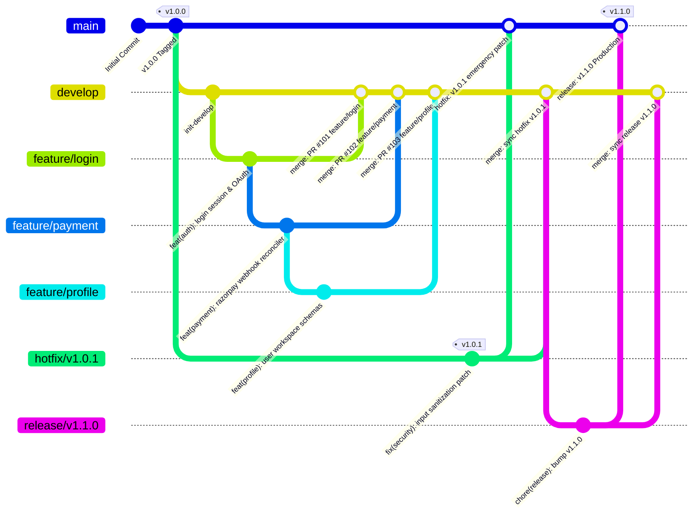

# Production Git Architecture & Strategy — Promise-to-Pay Tracker

Enterprise-grade Git architecture and branching model designed for robust CI/CD, isolated release staging, rapid hotfixing, and auditable code history.

---

## 1. Complete Git Architecture Diagram

```
                            PRODUCTION
                              │
                              ▼
                           main
                            │
                       v1.0.0 tag
                            │
                            │
             ┌──────────────┴──────────────┐
             │                             │
          hotfix                        release
             │                             │
          v1.0.1                        v1.1.0
             │                             │
             ▼                             ▼
           main ◄────────────────────── develop
                                         ▲
                                         │
                              ┌──────────┼──────────┐
                              │          │          │
                           feature    feature    feature
                           /login    /payment   /profile
```

---

## 2. Interactive Mermaid Architecture Flow



---

## 3. Branch Taxonomy & Environment Matrix

| Branch Type | Naming Convention | Origin Branch | Merge Target | Environment Deployed | Merge Strategy |
| :--- | :--- | :--- | :--- | :--- | :--- |
| **Production** | `main` | *Root* | *None (Protected)* | **Production (Live)** | `--no-ff` (Version Tagged) |
| **Integration** | `develop` | `main` | `main` (via release) | **QA / Dev Integration** | `--no-ff` (PR Merges) |
| **Feature** | `feature/<name>` | `develop` | `develop` | **Local / Ephemeral** | PR Review + `--no-ff` |
| **Release** | `release/vX.Y.Z` | `develop` | `main` & `develop` | **Staging / UAT** | `--no-ff` (Create Tag) |
| **Hotfix** | `hotfix/vX.Y.Z` | `main` (tag) | `main` & `develop` | **Staging -> Prod** | `--no-ff` (Patch Tag) |
| **Bugfix/Chore**| `fix/<name>`, `chore/<name>` | `develop` | `develop` | **Local / CI** | Squash or `--no-ff` |

---

## 4. End-to-End Workflow Playbooks

### Workflow 1: Feature Development (`feature/login`, `feature/payment`, `feature/profile`)
```bash
# 1. Update local develop branch
git checkout develop
git pull origin develop

# 2. Branch feature
git checkout -b feature/login

# 3. Work & Commit (Conventional Commits)
git commit -m "feat(auth): implement Google OAuth handler"
git commit -m "test(auth): add unit tests for token verification"

# 4. Push branch and open Pull Request into develop
git push -u origin feature/login

# 5. Merge into develop
git checkout develop
git merge --no-ff feature/login -m "merge: PR #101 feature/login into develop"
```

### Workflow 2: Release Staging & Deployment (`release/v1.1.0`)
```bash
# 1. Cut release branch from develop when feature freeze begins
git checkout develop && git pull origin develop
git checkout -b release/v1.1.0

# 2. Version bumps & changelog updates
git commit -m "chore(release): bump version to v1.1.0"

# 3. Merge into main and tag
git checkout main && git pull origin main
git merge --no-ff release/v1.1.0 -m "release: v1.1.0 — Production Release"
git tag -a v1.1.0 -m "Release v1.1.0: Production release with Auth, Payments, and Profiles"
git push origin main --tags

# 4. CRITICAL: Sync release back into develop
git checkout develop
git merge --no-ff release/v1.1.0 -m "merge: sync release v1.1.0 back to develop"
git push origin develop
```

### Workflow 3: Emergency Production Hotfix (`hotfix/v1.0.1`)
```bash
# 1. Branch immediately from main or release tag
git checkout main && git pull origin main
git checkout -b hotfix/v1.0.1 v1.0.0

# 2. Apply fix and test
git commit -m "fix(security): sanitize input validation (Hotfix v1.0.1)"
git tag -a v1.0.1 -m "Hotfix v1.0.1: Emergency security patch"

# 3. Merge hotfix to main
git checkout main
git merge --no-ff hotfix/v1.0.1 -m "hotfix: v1.0.1 emergency production security patch"
git push origin main --tags

# 4. CRITICAL: Sync hotfix back into develop
git checkout develop
git merge --no-ff hotfix/v1.0.1 -m "merge: sync hotfix v1.0.1 back to develop"
git push origin develop
```

---

## 5. CLI Automation Script

Run the built-in CLI automation scripts in `./scripts/`:

```powershell
# PowerShell
.\scripts\git-workflow.ps1 feature-start login
.\scripts\git-workflow.ps1 feature-finish login

.\scripts\git-workflow.ps1 release-start 1.1.0
.\scripts\git-workflow.ps1 release-finish 1.1.0

.\scripts\git-workflow.ps1 hotfix-start 1.0.1
.\scripts\git-workflow.ps1 hotfix-finish 1.0.1

.\scripts\git-workflow.ps1 sync-develop
.\scripts\git-workflow.ps1 status-graph
```

```bash
# Linux / macOS / Git Bash
./scripts/git-workflow.sh feature-start login
./scripts/git-workflow.sh feature-finish login

./scripts/git-workflow.sh release-start 1.1.0
./scripts/git-workflow.sh release-finish 1.1.0

./scripts/git-workflow.sh hotfix-start 1.0.1
./scripts/git-workflow.sh hotfix-finish 1.0.1

./scripts/git-workflow.sh sync-develop
./scripts/git-workflow.sh status-graph
```

---

## 6. Git Hooks & Governance

Install the repository hooks:
```powershell
.\scripts\setup-git-hooks.ps1
# or
./scripts/setup-git-hooks.sh
```

- **`commit-msg` Hook**: Enforces Conventional Commits (`feat:`, `fix:`, `chore:`, `docs:`, `test:`, `refactor:`).
- **`pre-push` Hook**: Restricts branch creation strictly to `main`, `develop`, `feature/*`, `hotfix/*`, `release/*`, `fix/*`.
