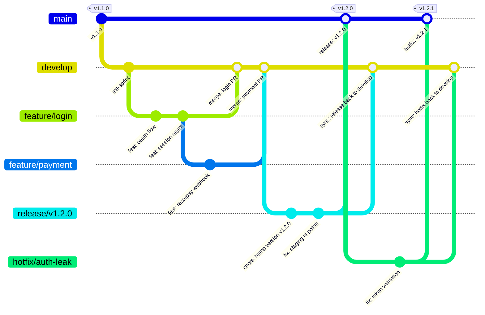

# Complete Git Architecture & Branching Strategy

A complete, production-grade Git architecture and branching model designed for robust CI/CD, isolated release staging, rapid hotfixing, and auditable code history.

---

## 1. High-Level Architecture Diagram

```
                                      ┌────────────────────────────────────────────────────────┐
                                      │                      main (PROD)                       │
                                      │            Protected • Tagged (v1.2.0, v1.2.1)         │
                                      └──────────▲────────────────────────▲─────────────────┬──┘
                                                 │                        │                 │
                                            Release Merge            Hotfix Merge      Branch Hotfix
                                            (v1.2.0 Tag)             (v1.2.1 Tag)      (Critical Bug)
                                                 │                        │                 │
                                      ┌──────────┴──────────┐   ┌─────────┴─────────┐       │
                                      │   release/v1.2.0    │   │ hotfix/auth-leak  │◄──────┘
                                      │ Staging / UAT / Q&A │   │ Urgent Prod Fix   │
                                      └──────▲──────────┬───┘   └─────────┬─────────┘
                                             │          │                 │
                                        Cut Release   Sync Back         Sync Back
                                        (Freeze)      Bugfixes          Hotfix
                                             │          │                 │
                                      ┌──────┴──────────▼─────────────────▼───┐
                                      │            develop (DEV/QA)           │
                                      │      Integration • Auto-Test Suites   │
                                      └──────▲───────────────▲─────────────▲──┘
                                             │               │             │
                                        PR / Review     PR / Review   PR / Review
                                             │               │             │
                              ┌──────────────┴──┐  ┌─────────┴──┐  ┌───────┴─────────┐
                              │  feature/login  │  │ feat/pay   │  │ feature/profile │
                              │   (Local/Dev)   │  │(Local/Dev) │  │   (Local/Dev)   │
                              └─────────────────┘  └────────────┘  └─────────────────┘
```

---

## 2. Interactive Mermaid Architecture



---

## 3. Branch Taxonomy & Environment Matrix

| Branch Type | Naming Convention | Origin Branch | Merge Target | Environment Deployed | Merge Strategy |
| :--- | :--- | :--- | :--- | :--- | :--- |
| **Production** | `main` | *Root* | *None (Protected)* | **Production** | `--no-ff` (Release Tag) |
| **Integration** | `develop` | `main` | `main` (via release) | **QA / Dev Integration** | `--no-ff` or Squash (per PR) |
| **Feature** | `feature/<name>` | `develop` | `develop` | **Ephemeral / Local** | Squash & Merge or Rebase |
| **Release** | `release/vX.Y.Z` | `develop` | `main` & `develop` | **Staging / Pre-prod / UAT**| `--no-ff` (Create Tag) |
| **Hotfix** | `hotfix/<name>` | `main` | `main` & `develop` | **Staging -> Prod** | `--no-ff` (Patch Tag) |
| **Bugfix/Chore**| `fix/<name>`, `chore/<name>` | `develop` | `develop` | **Ephemeral / Local** | Squash & Merge |

---

## 4. End-to-End Workflow Playbooks

### Workflow A: Feature Development Flow
```bash
# 1. Update local develop branch
git checkout develop
git pull origin develop

# 2. Branch feature
git checkout -b feature/login

# 3. Work & Commit (Conventional Commits)
git commit -m "feat(auth): implement Google OAuth handler"
git commit -m "test(auth): add unit tests for token verification"

# 4. Rebase onto latest develop before opening PR
git fetch origin
git rebase origin/develop

# 5. Push branch and open Pull Request into develop
git push -u origin feature/login
```

### Workflow B: Release Staging & Deployment Flow
```bash
# 1. Cut release branch from develop when feature freeze begins
git checkout develop && git pull origin develop
git checkout -b release/v1.2.0

# 2. Only changelog, version bumps, and bugfixes allowed on release branch
git commit -m "chore(release): bump version to 1.2.0"
git push -u origin release/v1.2.0

# 3. Once Staging/QA passes, merge into main and tag
git checkout main && git pull origin main
git merge --no-ff release/v1.2.0 -m "release: v1.2.0 — Production Release"
git tag -a v1.2.0 -m "Release v1.2.0"
git push origin main --tags

# 4. CRITICAL: Sync bug fixes & release commits back into develop
git checkout develop
git merge --no-ff release/v1.2.0 -m "merge: sync release v1.2.0 back to develop"
git push origin develop

# 5. Clean up remote and local release branches
git branch -d release/v1.2.0
git push origin --delete release/v1.2.0
```

### Workflow C: Emergency Production Hotfix Flow
```bash
# 1. Branch immediately from main (production state)
git checkout main && git pull origin main
git checkout -b hotfix/auth-leak

# 2. Fix the bug, test, and commit
git commit -m "fix(security): sanitize JWT token verification"
git push -u origin hotfix/auth-leak

# 3. Merge hotfix to main and tag patch version
git checkout main
git merge --no-ff hotfix/auth-leak -m "hotfix: v1.2.1 patch"
git tag -a v1.2.1 -m "Patch release v1.2.1"
git push origin main --tags

# 4. CRITICAL: Sync hotfix back into develop (and active release branch if open)
git checkout develop
git merge --no-ff hotfix/auth-leak -m "merge: sync hotfix v1.2.1 to develop"
git push origin develop

# 5. Clean up hotfix branch
git branch -d hotfix/auth-leak
git push origin --delete hotfix/auth-leak
```

---

## 5. Commit Standards (Conventional Commits)

Format: `<type>(<scope>): <short summary>`

```
feat(webhook): handle razorpay payment.captured event
fix(scheduler): pause escalation on unverified claim
test(extractor): add test fixtures for date parsing
docs(api): document invoice status state machine
chore(ci): update github actions python version to 3.12
```

---

## 6. GitHub Branch Protection & Governance Rules

1. **`main` Branch (Production)**:
   - 🔒 Direct commits disabled (`git push origin main` rejected).
   - 🔒 Requires Pull Request with minimum **2 approvals**.
   - 🔒 Requires all CI checks (`Backend Pytest`, `Frontend Build`, `Security Scan`) to pass.
   - 🔒 Force pushes and branch deletions disabled.

2. **`develop` Branch (Integration)**:
   - 🔒 Direct commits disabled for feature work.
   - 🔒 Requires Pull Request with minimum **1 approval**.
   - 🔒 Auto-runs CI suite on every push and PR.
   - 🔒 Automatically deletes merged feature branches.

3. **Release & Hotfix Sync Guard**:
   - Every merge into `main` must have a corresponding sync merge back into `develop` to prevent regression bugs.
